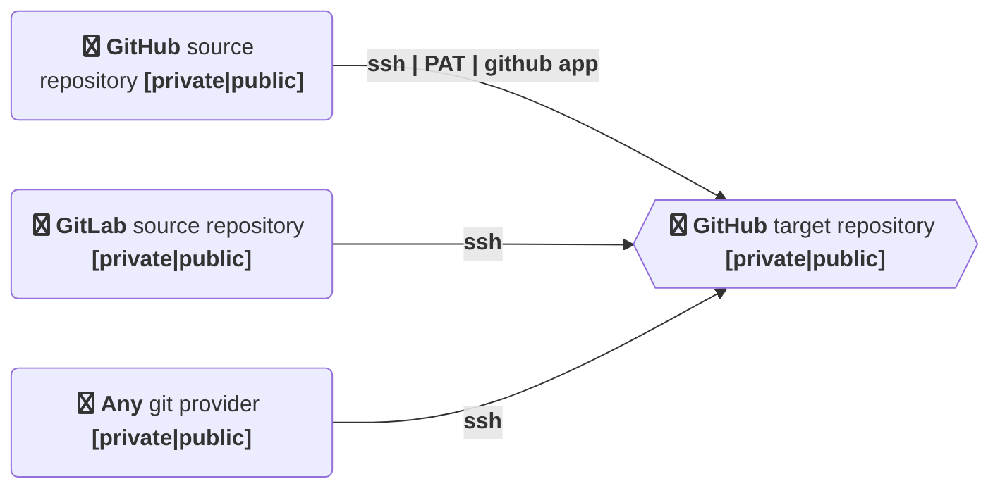
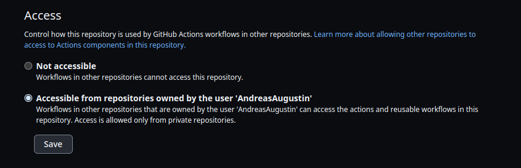

# actions-template-sync
<!-- ALL-CONTRIBUTORS-BADGE:START - Do not remove or modify this section -->
[](#contributors-)
<!-- ALL-CONTRIBUTORS-BADGE:END -->

 [](https://github.com/AndreasAugustin/actions-template-sync/actions/workflows/actions_template_sync.yml)

[](https://github.com/AndreasAugustin/actions-template-sync/actions/workflows/lint.yml)

[](https://github.com/AndreasAugustin/actions-template-sync/actions/workflows/shellcheck.yml)

[](https://github.com/AndreasAugustin/actions-template-sync/actions/workflows/test.yml)

[](https://github.com/AndreasAugustin/actions-template-sync/actions/workflows/test_hooks.yml)

[](https://github.com/AndreasAugustin/actions-template-sync/actions/workflows/test_ssh.yml)

[](https://github.com/AndreasAugustin/actions-template-sync/actions/workflows/test_ssh_gitlab.yml)

[](https://github.com/AndreasAugustin/actions-template-sync/actions/workflows/push_docker.yml)

[](https://github.com/AndreasAugustin/actions-template-sync/actions/workflows/gh_pages_mk_docs.yml)

## abstract

Synchronise git repositories in an automated manner. Different git providers like GitHub (enterprise), GitLab,.. are supported as the source provider.
This can help you e.g. for migration from another git provider to GitHub or if you want to mirror git repositories.

### History

It is possible to create repositories within Github with
[GitHub templates](https://docs.github.com/en/github/creating-cloning-and-archiving-repositories/creating-a-template-repository).
This is a nice approach to have some boilerplate within your repository.
Over the time the template repository will get some code changes.
The problem is that the already created repositories won't know about those changes.
This GitHub action will help you to keep track of the template changes.
The initial author of this repository faced that issue several times and decided to write a github action to face that issue.
Because of the nice community, several feature requests helped to go on with development of the action. Now several other features are supported.

## Features



* Sync other public or private repository (e.g. template repositories) with the current repository
* Ignore files and folders from syncing using a `.templatesyncignore` file
* many configuration options
* different lifecycle hooks are supported. This opens the possibility to inject custom code into the workflow with a yaml definition file.
* different git provider like GitLab, Gittea,.. as source are supported (with ssh).
  See [.github/workflows/test_ssh_gitlab.yml](.github/workflows/test_ssh_gitlab.yml) for an example.
* It is not necesarly needed that source and target repository have same base history.
  Because of that reason it is possible to merge 2 total different repositories with the help of the action.

## Usage

Usage changes depending on whether the template repository is public or private, regardless of the visibility of current repository.

### Public template repository

Add this configuration to a github action in the current repository:

```yaml
# File: .github/workflows/template-sync.yml

on:
    # cronjob trigger
  schedule:
  - cron:  "0 0 1 * *"
  # manual trigger
  workflow_dispatch:
jobs:
  repo-sync:
    runs-on: ubuntu-latest

    steps:
      # To use this repository's private action, you must check out the repository
      - name: Checkout
        uses: actions/checkout@v3
      - name: actions-template-sync
        uses: AndreasAugustin/actions-template-sync@v0.8.0
        with:
          github_token: ${{ secrets.GITHUB_TOKEN }}
          source_repo_path: <owner/repo>
          upstream_branch: <target_branch> # defaults to main
          pr_labels: <label1>,<label2>[,...] # optional, no default
```

You will receive a pull request within your repository if there are some changes available in the template.

### Private template repository

If your current repository was created from a private template, there are several possibilities.

#### 1. Using github app

You can create and use a [GitHub App][github-app] to handle the access to the private template repository.
To generate a token for your app you can use a separate action like [tibdex/github-app-token][github-app-token].
You have to setup the checkout step with the generated token as well.

```yaml
jobs:
  repo-sync:
    runs-on: ubuntu-latest

    steps:
     - name: Generate token to read from source repo # see: https://github.com/tibdex/github-app-token
        id: generate_token
        uses: tibdex/github-app-token@v1
        with:
          app_id: ${{ secrets.APP_ID }}
          private_key: ${{ secrets.PRIVATE_KEY }}
      - name: Checkout
        uses: actions/checkout@v3
        with:
          token: ${{ steps.generate_token.outputs.token }}
      - name: actions-template-sync
        uses: AndreasAugustin/actions-template-sync@v0.8.0
        with:
          github_token: ${{ steps.generate_token.outputs.token }}
          source_repo_path: <owner/repo>
          upstream_branch: <target_branch> # defaults to main
          pr_labels: <label1>,<label2>[,...] # optional, no default
```

#### 2. SSH

You have various options to use ssh keys with GitHub.
An example are [deployment keys][deployment-keys]. For our use case write permissions are not needed.
Within the current repository, where the GitHub action is enabled, add a secret
(e.q. `SOURCE_REPO_SSH_PRIVATE_KEY`) with the content of your private SSH key.
Make sure that the read permissions of that secret fulfil your use case.
Set the optional `source_repo_ssh_private_key` input parameter.
It is also possible to use a different git provider, e.g. GitLab.

```yaml
jobs:
  repo-sync:
    runs-on: ubuntu-latest

    steps:
      # To use this repository's private action, you must check out the repository
      - name: Checkout
        uses: actions/checkout@v3
      - name: actions-template-sync
        uses: AndreasAugustin/actions-template-sync@v0.8.0
        with:
          github_token: ${{ secrets.GITHUB_TOKEN }}
          source_repo_path: ${{ secrets.SOURCE_REPO_PATH }} # <owner/repo>, should be within secrets
          upstream_branch: ${{ secrets.TARGET_BRANCH }} #<target_branch> # defaults to main
          pr_labels: <label1>,<label2>[,...] # optional, no default
          source_repo_ssh_private_key: ${{ secrets.SOURCE_REPO_SSH_PRIVATE_KEY }} # contains the private ssh key of the private repository
```

#### 3. PAT

:warning: when the source repository is private using PATs, also the target repository must be private.
Else it won't work.

[Personal access token][github-pat] are an alternative to using passwords for authentication to GitHubYou can add a kind
of password to your github account. You need to set the scopes

* `repo` -> all
* `read:org`


Furthermore you need to set the access within the source repository to allow github actions within the target repository.
As mentioned before (you can see the note in the image) you need to set the target repository to private.
settings -> actions -> general.



example workflow definition

```yml
name: actions-template-sync

on:
  # cronjob trigger At 00:00 on day-of-month 1. https://crontab.guru/every-month
  schedule:
  - cron:  "0 0 1 * *"
  # manual trigger
  workflow_dispatch:

jobs:
  test-implementation-job:

    runs-on: ubuntu-latest

    steps:
      # To use this repository's private action, you must check out the repository
      -
        name: Checkout
        uses: actions/checkout@v3
      -
        name: Test action step PAT
        uses: AndreasAugustin/actions-template-sync@v0.8.0
        with:
          github_token: ${{ secrets.SOURCE_REPO_PAT }}
          source_repo_path: ${{ secrets.SOURCE_REPO_PATH }} # <owner/repo>, should be within secrets
```

### Configuration parameters

| Variable | Description | Required | `[Default]` |
|----|----|----|----|
| github_token | Token for the repo. Can be passed in using `$\{{ secrets.GITHUB_TOKEN }}` | `true` |  |
| source_repo_path | Repository path of the template | `true` | |
| upstream_branch | The target branch | `true` | `main` |
| source_repo_ssh_private_key | `[optional]` private ssh key for the source repository. [see](#private-template-repository)| `false` |  |
| pr_branch_name_prefix | `[optional]` the prefix of branches created by this action | `false` | `chore/template_sync`  |
| pr_title | `[optional]` the title of PRs opened by this action. Must be already created. | `false` | `upstream merge template repository`  |
| pr_labels | `[optional]` comma separated list. [pull request labels][pr-labels]. Must be already created. | `false` | |
| pr_commit_msg | `[optional]` commit message in the created pull request | `false` | `chore(template): merge template changes :up:` |
| hostname | `[optional]` the hostname of the repository | `false` | `github.com` |
| is_dry_run | `[optional]` set to `true` if you do not want to push the changes and not want to create a PR |  `false` |   |
| is_allow_hooks | `[optional]` set to `true` if you want to enable lifecycle hooks. Use this with caution! | `false` | `false` |
| is_not_source_github | `[optional]` set to `true` if the source git provider is not GitHub | `false` | `false` |
| git_user_name | `[optional]` set the committer git user.name | `false` | `${GITHUB_ACTOR}` |
| git_user_email | `[optional]` set the committer git user.email | `false` | `github-action@actions-template-sync.noreply.${SOURCE_REPO_HOSTNAME}` |
| git_remote_pull_params |`[optional]` set remote pull parameters | `false` | `--allow-unrelated-histories --squash --strategy=recursive -X theirs` |

### Example

This repo uses this [template][template] and this action from the [marketplace][marketplace].
See the definition [here][self-usage].

If you look for a more detailed guide you can have a look at [Dev.to][devto-example] or [GitHub][github-example]

### Trigger

You can use all [triggers][action-triggers] which are supported for GitHub actions

## Ignore Files

Create a `.templatesyncignore` file. Just like writing a `.gitignore` file, follow the [glob pattern][glob-pattern]
in defining the files and folders that should be excluded from syncing with the template repository.

It can also be stored inside `.github` folder.

_Note: It is not possible to sync also the `.templatesyncignore` itself. Any changes from the template repository will be restored automatically._

## Lifecycle hooks

Different lifecycle hooks are supported. You need enable the functionality with the option `is_allow_hooks` and set it to `true`
:warning: use this functionality with caution. You can use one of the available docker images to test it out. **With great power comes great responsibility**.

* [dockerhub andyaugustin/actions-template-sync][dockerhub-repo]
* [github andreasaugustin/actions-template-sync][github-repo]

In addition you need a configuration file with the name `templatesync.yml` within the root of the target repository.

Following hooks are supported (please check [docs/ARCHITECTURE.md](docs/ARCHITECTURE.md) for a better understanding of the lifecycles).

* `install` is executed after the container has started and after reading and setting up the environment.
* `prepull` is executed before the code is pulled from the source repository
* `prepush` is executed before the push is executed, right after the commit
* `prepr` is executed before the PR is done

**Remark** The underlying OS is defined by an alpine container.
E.q. for the installation phase you need to use commands like `apk add --update --no-cache python3`

Schema and example for the `temlatesync.yml`

```yml
hooks:
  install:
    commands:
      - apk add --update --no-cache python3
      - python3 --version
  prepull:
    commands:
      - echo 'hi, we are within the prepull phase'
      - echo 'maybe you want to do adjustments on the local code'
  prepush:
    commands:
      - echo 'hi, we are within the prepush phase'
      - echo 'maybe you want to add further changes and commits'
  prepr:
    commands:
      - echo 'hi, we are within the prepr phase'
      - echo 'maybe you want to change the code a bit and do another push before creating the pr'
```

## Troubleshooting

* refusing to allow a GitHub App to create or update workflow `.github/workflows/******.yml` without `workflows` permission

This happens because the template repository is trying to overwrite some files inside `.github/workflows/`.
Currently a github action can't overwrite these files.
To ignore those, simply create a file in the root directory named `.templatesyncignore` with the content `.github/workflows/`.

* pull request create failed: GraphQL: GitHub Actions is not permitted to create or approve pull requests (createPullRequest)

Open your project `Settings > Actions > General` and select the checkbox `Allow Github Actions to create and approve pull requests`
under the `Workflow permissions` section.

## Release Updates

starting with version v0.5.2-draft the `templateversionrc` file is not needed anymore. You can delete that file from the target repositories.

## Debug

You must create a secret named `ACTIONS_STEP_DEBUG` with the value `true` to see the debug messages set by this command in the log.
For more information, see "[Enabling debug logging.][enabling-debug-logging]"

## DEV

The development environment targets are located in the [Makefile](Makefile)

```bash
make help
```

For some architectural notes please have a look into [docs](./docs/README.md)

## Contributors ✨

Thanks goes to these wonderful people ([emoji key](https://allcontributors.org/docs/en/emoji-key)):

<!-- ALL-CONTRIBUTORS-LIST:START - Do not remove or modify this section -->
<!-- prettier-ignore-start -->
<!-- markdownlint-disable -->
<table>
  <tbody>
    <tr>
      <td align="center" valign="top" width="14.28%"><a href="https://github.com/AndreasAugustin"><br /><sub><b>andy Augustin</b></sub></a><br /><a href="https://github.com/AndreasAugustin/actions-template-sync/commits?author=AndreasAugustin" title="Documentation">📖</a> <a href="https://github.com/AndreasAugustin/actions-template-sync/commits?author=AndreasAugustin" title="Code">💻</a> <a href="https://github.com/AndreasAugustin/actions-template-sync/pulls?q=is%3Apr+reviewed-by%3AAndreasAugustin" title="Reviewed Pull Requests">👀</a> <a href="#security-AndreasAugustin" title="Security">🛡️</a> <a href="#ideas-AndreasAugustin" title="Ideas, Planning, & Feedback">🤔</a> <a href="#question-AndreasAugustin" title="Answering Questions">💬</a> <a href="#example-AndreasAugustin" title="Examples">💡</a> <a href="#content-AndreasAugustin" title="Content">🖋</a> <a href="#blog-AndreasAugustin" title="Blogposts">📝</a></td>
      <td align="center" valign="top" width="14.28%"><a href="https://www.iit.it/people/ugo-pattacini"><br /><sub><b>Ugo Pattacini</b></sub></a><br /><a href="https://github.com/AndreasAugustin/actions-template-sync/commits?author=pattacini" title="Documentation">📖</a></td>
      <td align="center" valign="top" width="14.28%"><a href="https://github.com/jg-rivera"><br /><sub><b>Jose Gabrielle Rivera</b></sub></a><br /><a href="https://github.com/AndreasAugustin/actions-template-sync/commits?author=jg-rivera" title="Code">💻</a></td>
      <td align="center" valign="top" width="14.28%"><a href="http://pdrittenhouse.com"><br /><sub><b>P.D. Rittenhouse</b></sub></a><br /><a href="#ideas-pdrittenhouse" title="Ideas, Planning, & Feedback">🤔</a></td>
      <td align="center" valign="top" width="14.28%"><a href="https://github.com/Daniel-Boll"><br /><sub><b>Daniel Boll</b></sub></a><br /><a href="https://github.com/AndreasAugustin/actions-template-sync/issues?q=author%3ADaniel-Boll" title="Bug reports">🐛</a></td>
      <td align="center" valign="top" width="14.28%"><a href="https://github.com/albertschwarzkopf"><br /><sub><b>albertschwarzkopf</b></sub></a><br /><a href="#ideas-albertschwarzkopf" title="Ideas, Planning, & Feedback">🤔</a></td>
      <td align="center" valign="top" width="14.28%"><a href="http://akulpillai.com"><br /><sub><b>Akul Pillai</b></sub></a><br /><a href="#security-akulpillai" title="Security">🛡️</a></td>
    </tr>
    <tr>
      <td align="center" valign="top" width="14.28%"><a href="https://github.com/steveizzle"><br /><sub><b>Stefan Riembauer</b></sub></a><br /><a href="#ideas-steveizzle" title="Ideas, Planning, & Feedback">🤔</a></td>
      <td align="center" valign="top" width="14.28%"><a href="http://fabriziocacicia.com"><br /><sub><b>Fabrizio Cacicia</b></sub></a><br /><a href="#security-fabriziocacicia" title="Security">🛡️</a> <a href="https://github.com/AndreasAugustin/actions-template-sync/issues?q=author%3Afabriziocacicia" title="Bug reports">🐛</a></td>
      <td align="center" valign="top" width="14.28%"><a href="https://github.com/JTunis"><br /><sub><b>Justin Tunis</b></sub></a><br /><a href="#ideas-JTunis" title="Ideas, Planning, & Feedback">🤔</a> <a href="https://github.com/AndreasAugustin/actions-template-sync/commits?author=JTunis" title="Code">💻</a> <a href="https://github.com/AndreasAugustin/actions-template-sync/issues?q=author%3AJTunis" title="Bug reports">🐛</a></td>
      <td align="center" valign="top" width="14.28%"><a href="https://mikematos84.github.io"><br /><sub><b>Michael Matos</b></sub></a><br /><a href="https://github.com/AndreasAugustin/actions-template-sync/issues?q=author%3Amikematos84" title="Bug reports">🐛</a></td>
      <td align="center" valign="top" width="14.28%"><a href="https://github.com/fatmcgav-depop"><br /><sub><b>Gavin Williams</b></sub></a><br /><a href="#ideas-fatmcgav-depop" title="Ideas, Planning, & Feedback">🤔</a></td>
      <td align="center" valign="top" width="14.28%"><a href="https://github.com/msiebeneicher"><br /><sub><b>Marc Siebeneicher</b></sub></a><br /><a href="#ideas-msiebeneicher" title="Ideas, Planning, & Feedback">🤔</a> <a href="https://github.com/AndreasAugustin/actions-template-sync/commits?author=msiebeneicher" title="Code">💻</a> <a href="https://github.com/AndreasAugustin/actions-template-sync/issues?q=author%3Amsiebeneicher" title="Bug reports">🐛</a> <a href="https://github.com/AndreasAugustin/actions-template-sync/commits?author=msiebeneicher" title="Documentation">📖</a></td>
      <td align="center" valign="top" width="14.28%"><a href="https://github.com/LuisHenri"><br /><sub><b>Luís Henrique A. Schünemann</b></sub></a><br /><a href="#ideas-LuisHenri" title="Ideas, Planning, & Feedback">🤔</a> <a href="https://github.com/AndreasAugustin/actions-template-sync/commits?author=LuisHenri" title="Documentation">📖</a> <a href="https://github.com/AndreasAugustin/actions-template-sync/commits?author=LuisHenri" title="Code">💻</a></td>
    </tr>
    <tr>
      <td align="center" valign="top" width="14.28%"><a href="https://github.com/george-gca"><br /><sub><b>George</b></sub></a><br /><a href="#question-george-gca" title="Answering Questions">💬</a> <a href="https://github.com/AndreasAugustin/actions-template-sync/commits?author=george-gca" title="Documentation">📖</a> <a href="#ideas-george-gca" title="Ideas, Planning, & Feedback">🤔</a></td>
      <td align="center" valign="top" width="14.28%"><a href="http://www.linkedin.com/in/pedrorrivero/"><br /><sub><b>Pedro Rivero</b></sub></a><br /><a href="#ideas-pedrorrivero" title="Ideas, Planning, & Feedback">🤔</a></td>
    </tr>
  </tbody>
</table>

<!-- markdownlint-restore -->
<!-- prettier-ignore-end -->

<!-- ALL-CONTRIBUTORS-LIST:END -->

This project follows the [all-contributors](https://github.com/all-contributors/all-contributors)
specification. Contributions of any kind welcome!

[enabling-debug-logging]: https://docs.github.com/en/actions/managing-workflow-runs/enabling-debug-logging
[deployment-keys]: https://docs.github.com/en/developers/overview/managing-deploy-keys#deploy-keys
[action-triggers]: https://docs.github.com/en/actions/reference/events-that-trigger-workflows
[template]: https://github.com/AndreasAugustin/template
[marketplace]: https://github.com/marketplace/actions/actions-template-sync
[self-usage]: https://github.com/AndreasAugustin/actions-template-sync/blob/main/.github/workflows/actions_template_sync.yml
[pr-labels]: https://docs.github.com/en/issues/using-labels-and-milestones-to-track-work/managing-labels
[devto-example]: https://dev.to/andreasaugustin/github-actions-template-sync-1g9k
[github-example]: https://github.com/AndreasAugustin/teaching/blob/main/docs/git/git_action_sync.md
[github-app]: https://docs.github.com/en/developers/apps/getting-started-with-apps/about-apps#about-github-apps
[glob-pattern]: https://en.wikipedia.org/wiki/Glob_(programming)
[github-app-token]: https://github.com/tibdex/github-app-token
[dockerhub-repo]: https://hub.docker.com/r/andyaugustin/actions-template-sync
[github-repo]: https://github.com/AndreasAugustin/actions-template-sync/pkgs/container/actions-template-sync
[github-pat]: https://docs.github.com/en/authentication/keeping-your-account-and-data-secure/creating-a-personal-access-token
