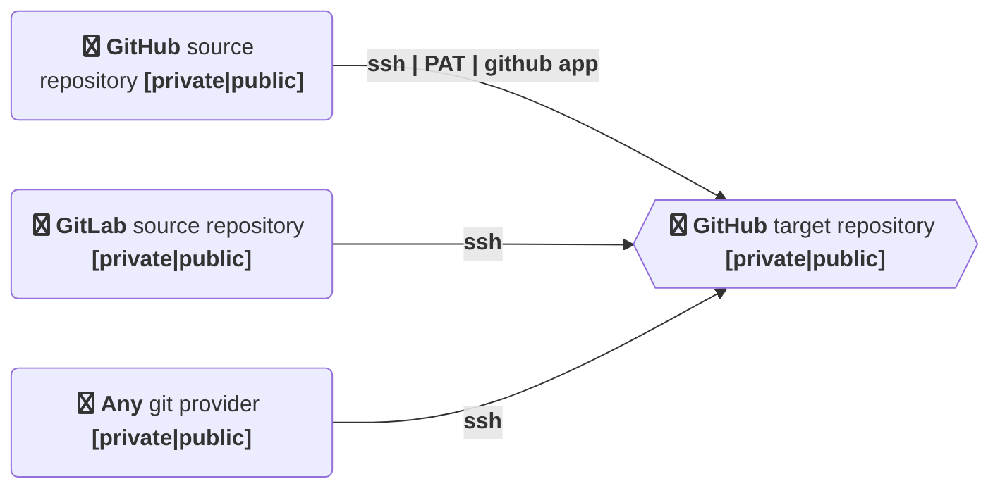

# actions-template-sync
<!-- ALL-CONTRIBUTORS-BADGE:START - Do not remove or modify this section -->
[](#contributors-)
<!-- ALL-CONTRIBUTORS-BADGE:END -->

 [](https://github.com/AndreasAugustin/actions-template-sync/actions/workflows/actions_template_sync.yml)

[](https://github.com/AndreasAugustin/actions-template-sync/actions/workflows/lint.yml)

[](https://github.com/AndreasAugustin/actions-template-sync/actions/workflows/shellcheck.yml)

[](https://github.com/AndreasAugustin/actions-template-sync/actions/workflows/test.yml)

[](https://github.com/AndreasAugustin/actions-template-sync/actions/workflows/test_hooks.yml)

[](https://github.com/AndreasAugustin/actions-template-sync/actions/workflows/test_ssh.yml)

[](https://github.com/AndreasAugustin/actions-template-sync/actions/workflows/test_ssh_gitlab.yml)

[](https://github.com/AndreasAugustin/actions-template-sync/actions/workflows/push_docker.yml)

[](https://github.com/AndreasAugustin/actions-template-sync/actions/workflows/gh_pages_mk_docs.yml)

## abstract

Synchronise git repositories in an automated manner. Different git providers like GitHub (enterprise), GitLab,.. are supported as the source provider.
This can help you e.g. for migration from another git provider to GitHub or if you want to mirror git repositories.

### History

It is possible to create repositories within Github with
[GitHub templates](https://docs.github.com/en/github/creating-cloning-and-archiving-repositories/creating-a-template-repository).
This is a nice approach to have some boilerplate within your repository.
Over time, the template repository will get some code changes.
The problem is that the already created repositories won't know about those changes.
This GitHub action will help you to keep track of the template changes.
The initial author of this repository faced that issue several times and decided to write a GitHub action to face that issue.
Because of the nice community, several feature requests helped to go on with the development of the action. Now several other features are supported.

## Features

This action is creating a pull request with the latest changes within the target repo whenever it runs with following exceptions

* there is already an open PR created with the latest changes of the source repository.
  * if there are new changes and a PR is already open, a new PR will be created (option to clean up older PRs)
* related new changes are ignored within the `.templatesyncignore` file
* the source repository is fully included within the target repository



* Sync other public or private repository (e.g. template repositories) with the current repository
* Ignore files and folders from syncing using a `.templatesyncignore` file
* many configuration options
* different lifecycle hooks are supported. This opens the possibility to inject custom code into the workflow with a yaml definition file.
* different git provider like GitLab, Gittea,.. as source are supported (with ssh).
  See [.github/workflows/test_ssh_gitlab.yml](.github/workflows/test_ssh_gitlab.yml) for an example.
* It is not necessarily needed that source and target repository have the same base history.
  Because of that reason, it is possible to merge 2 totally different repositories with the help of the action.

## Usage

Usage changes depending on whether the template repository is public or private, regardless of the visibility of the current repository.

### Public template repository

Add this configuration to a GitHub action in the current repository:

```yaml
# File: .github/workflows/template-sync.yml

on:
  # cronjob trigger
  schedule:
  - cron: "0 0 1 * *"
  # manual trigger
  workflow_dispatch:
jobs:
  repo-sync:
    runs-on: ubuntu-latest
    # https://docs.github.com/en/actions/using-jobs/assigning-permissions-to-jobs
    permissions:
      contents: write
      pull-requests: write

    steps:
      # To use this repository's private action, you must check out the repository
      - name: Checkout
        uses: actions/checkout@v4
        # https://github.com/actions/checkout#usage
        # uncomment if you use submodules within the repository
        # with:
        #   submodules: true

      - name: actions-template-sync
        uses: AndreasAugustin/actions-template-sync@v2
        with:
          source_repo_path: <owner/repo>
          upstream_branch: <target_branch> # defaults to main
          pr_labels: <label1>,<label2>[,...] # defaults to template_sync
```

You will receive a pull request within your repository if there are some changes available in the template.

### Private template repository

If your current repository was created from a private template, there are several possibilities.

#### 1. Using a GitHub app

You can create and use a [GitHub App][github-app] to handle access to the private template repository.
To generate a token for your app you can use a separate action like [tibdex/github-app-token][github-app-token].
You have to set up the checkout step with the generated token as well.

```yaml
jobs:
  repo-sync:
    runs-on: ubuntu-latest

    steps:
      - name: Generate token to read from source repo # see: https://github.com/tibdex/github-app-token
        id: generate_token
        # https://github.com/tibdex/github-app-token
        uses: tibdex/github-app-token@v2
        with:
          app_id: ${{ secrets.APP_ID }}
          private_key: ${{ secrets.PRIVATE_KEY }}

      - name: Checkout
        # https://github.com/actions/checkout#usage
        uses: actions/checkout@v4
        with:
          # submodules: true
          token: ${{ steps.generate_token.outputs.token }}

      - name: actions-template-sync
        uses: AndreasAugustin/actions-template-sync@v2
        with:
          github_token: ${{ steps.generate_token.outputs.token }}
          source_repo_path: <owner/repo>
          upstream_branch: <target_branch> # defaults to main
          pr_labels: <label1>,<label2>[,...] # defaults to template_sync
```

#### 2. Using SSH

You have various options to use ssh keys with GitHub.
An example is [deployment keys][deployment-keys]. For our use case, write permissions are not needed.
Within the current repository, where the GitHub action is enabled, add a secret
(e.q. `SOURCE_REPO_SSH_PRIVATE_KEY`) with the content of your private SSH key.
Make sure that the read permissions of that secret fulfill your use case.
Set the optional `source_repo_ssh_private_key` input parameter.
It is also possible to use a different git provider, e.g. GitLab.

```yaml
jobs:
  repo-sync:
    runs-on: ubuntu-latest
    # https://docs.github.com/en/actions/using-jobs/assigning-permissions-to-jobs
    permissions:
      contents: write
      pull-requests: write

    steps:
      # To use this repository's private action, you must check out the repository
      - name: Checkout
        # https://github.com/actions/checkout#usage
        uses: actions/checkout@v4
        with:
          # submodules: true
          token: ${{ secrets.GITHUB_TOKEN }}

      - name: actions-template-sync
        uses: AndreasAugustin/actions-template-sync@v2
        with:
          github_token: ${{ secrets.GITHUB_TOKEN }}
          source_repo_path: ${{ secrets.SOURCE_REPO_PATH }} # <owner/repo>, should be within secrets
          upstream_branch: ${{ secrets.TARGET_BRANCH }} #<target_branch> # defaults to main
          pr_labels: <label1>,<label2>[,...] # defaults to template_sync
          source_repo_ssh_private_key: ${{ secrets.SOURCE_REPO_SSH_PRIVATE_KEY }} # contains the private ssh key of the private repository
```

#### 3. Using a PAT

:warning: when the source repository is private using PATs, also the target repository must be private.
Else it won't work.

[Personal access token][github-pat] is an alternative to using passwords for authentication to GitHub. You can add a kind
of password to your GitHub account. You need to set the scopes.

* `repo` -> all
* `read:org`


Furthermore, you need to set the access within the source repository to allow GitHub actions within the target repository.
As mentioned before (you can see the note in the image) you need to set the target repository to private.
settings -> actions -> general.


example workflow definition

```yml
name: actions-template-sync

on:
  # cronjob trigger At 00:00 on day-of-month 1. https://crontab.guru/every-month
  schedule:
  - cron: "0 0 1 * *"
  # manual trigger
  workflow_dispatch:

jobs:
  test-implementation-job:

    runs-on: ubuntu-latest

    steps:
      # To use this repository's private action, you must check out the repository
      - name: Checkout
        uses: actions/checkout@v4
        with:
          # submodules: true
          token: ${{ secrets.CUSTOM_GITHUB_PAT }}

      - name: Test action step PAT
        uses: AndreasAugustin/actions-template-sync@v2
        with:
          github_token: ${{ secrets.CUSTOM_GITHUB_PAT }}
          source_repo_path: ${{ secrets.SOURCE_REPO_PATH }} # <owner/repo>, should be within secrets
```

### Action Inputs

| Variable                    | Description                                                                                                   | Required | Default                                                           |
|-----------------------------|---------------------------------------------------------------------------------------------------------------|----------|-----------------------------------------------------------------------|
| github_token                | Token for the repo. Can be passed in using `${{ secrets.GITHUB_TOKEN }}`                                     | `true`   |   `${{ github.token }}`                                                                    |
| source_repo_path            | Repository path of the template                                                                               | `true`   |                                                                       |
| upstream_branch             | The target branch                                                                                             | `false`  | The remote's default (usually `main`)                                                |
| source_repo_ssh_private_key | `[optional]` private ssh key for the source repository. [see](#private-template-repository)                   | `false`  |                                                                       |
| pr_branch_name_prefix       | `[optional]` the prefix of branches created by this action                                                    | `false`  | `chore/template_sync`                                                 |
| pr_title                    | `[optional]` the title of PRs opened by this action. Must be already created.                                 | `false`  | `upstream merge template repository`                                  |
| pr_body                     | `[optional]` the body of PRs opened by this action. | `false` | `Merge ${SOURCE_REPO} ${TEMPLATE_GIT_HASH}` |
| pr_labels                   | `[optional]` comma separated list. [pull request labels][pr-labels].                                          | `false`  | `sync_template`                                                       |
| pr_reviewers                | `[optional]` comma separated list of pull request reviewers.                                                  | `false`  |                                                                       |
| pr_commit_msg               | `[optional]` commit message in the created pull request                                                       | `false`  | `chore(template): merge template changes :up:`                        |
| hostname                    | `[optional]` the hostname of the repository                                                                   | `false`  | `github.com`                                                          |
| is_git_lfs | `[optional]` set to `true` if you want to enalbe git lfs | `false` | `false` |
| is_dry_run                  | `[optional]` set to `true` if you do not want to push the changes and not want to create a PR                 | `false`  |                                                                       |
| is_allow_hooks              | `[optional]` set to `true` if you want to enable lifecycle hooks. Use this with caution!                      | `false`  | `false`                                                               |
| hooks | `[optional]` please check the lifecycle hooks section below | `false` | |
| is_force_push_pr            | `[optional]` set to `true` if you want to force push and pr update. Needs further permissions (see below) | `false`  | `false`                                                               |
| is_pr_cleanup               | `[optional]` set to `true` if you want to cleanup older PRs targeting the same branch. Use this with caution! | `false`  | `false`                                                               |
| is_keep_branch_on_pr_cleanup | `[optional]` set to `true` if you want to keep the branch when pr is cleanup. Only makes sense together with `is_pr_cleanup` | `false` | `false` |
| is_not_source_github        | `[optional]` set to `true` if the source git provider is not GitHub                                           | `false`  | `false`                                                               |
| is_force_deletion | `[optional]` set to `true` if you want to force delete files which are deleted within the source repository even if they contain changes. You need to also adjust `git_remote_pull_params` (see below for details) | `false` | `false` |
| git_user_name               | `[optional]` set the committer git user.name                                                                  | `false`  | `${GITHUB_ACTOR}`                                                     |
| git_user_email              | `[optional]` set the committer git user.email                                                                 | `false`  | `github-action@actions-template-sync.noreply.${SOURCE_REPO_HOSTNAME}` |
| git_remote_pull_params      | `[optional]` set remote pull parameters                                                                       | `false`  | `--allow-unrelated-histories --squash --strategy=recursive -X theirs` |
| gpg_private_key | `[optional]` set if you want to sign commits | `false` | |
| gpg_passphrase | `[optional]` set if your optionial gpg private key has a passphrase | `false` | |
| steps | `[optional] add the steps you want to execute within the action` | `false` | all steps will be executed |
| template_sync_ignore_file_path | `[optional] set the path to the ignore file.` | false |`.templatesyncignore` |
| is_with_tags | `[optional]` set to `true` if tags should be synced | `false` | `false` |

### Action Outputs

> Properties that are available after the action executed.

| output | description |
| ------ | ----------- |
| pr_branch | The name of the branch used for the pull request |
| template_git_hash | The template source repository git hash |

**Remarks** Please consider following edge cases

* **pr_branch**
  * If PR branch already exists (e.g. after a 2nd run) the action won't update the branch but will still output the branch name
  * If the remote repository already contains the source repository changes the action will exit and the output variable will be undefined
  * If there are no changes the action will exit and the output variable will be undefined

### Docker

There are docker images available. Please checkout [How to use docker](docs/DOCKER.md) for details.

* [dockerhub andyaugustin/actions-template-sync][dockerhub-repo]
* [github andreasaugustin/actions-template-sync][github-repo]

### Example

This repo uses this [template][template] and this action from the [marketplace][marketplace].
See the definition [here][self-usage].

If you look for a more detailed guide you can have a look at

* [Dev.to][devto-example]
* [GitHub][github-example]
* :heart: [nice blog post][dotdc-blog]

### Trigger

You can use all [triggers][action-triggers] which are supported for GitHub actions

## Ignore Files

Create a `.templatesyncignore` file. Just like writing a `.gitignore` file, follow the [glob pattern][glob-pattern]
in defining the files and folders that should be excluded from syncing with the template repository.

It can also be stored inside `.github` folder.

The `template_sync_ignore_file_path` parameter allows you to specify a path to an ignore file. This variable defaults to `.templatesyncignore`.
Changing this allows you to support template sync with more than one repository using different ignore files.

The action will look for the path specified within `.` or `.github/`

_Note: It is not possible to sync also the `.templatesyncignore` itself. Any changes from the template repository will be restored automatically._

**Remark** reading the [gitglossary][git-glossary] (_pathspec_ section) you see a slight difference to the `.gitignore` file
when you like to disable files you need to use `:!`.
E.g. when you like to disable the sync for all files with exceptions, you need to do smth like

```txt
:!newfile-1.txt
*
```

## Force Push and PR

If you set the input `is_force_push_pr` to `true` you are able to react to e.g. metadata changes within the workflow definition file.
Please note that you need to add permissions for `repository-projects: read`. Compare the needed scope with [gh pr edit][github-gh-cli-pr-edit]

```yaml
  permissions:
    contents: write
    pull-requests: write
    repository-projects: read
```

## Sign commits

It is recommended to [sign your commits][devto-sign-commits]. This action is able to sign commits.

First, [generate a GPG key][github-create-gpg-key] and export the GPG private key as an ASCII armored version to your clipboard:

```bash
# macOS
gpg --armor --export-secret-key jon@doe.example | pbcopy

# Ubuntu (assuming GNU base64)
gpg --armor --export-secret-key jon@doe.example -w0 | xclip

# Arch
gpg --armor --export-secret-key jon@doe.example | xclip -selection clipboard -i

# FreeBSD (assuming BSD base64)
gpg --armor --export-secret-key jon@doe.example | xclip
```

:warning: the gpg username and email must match the `git_user_name` and `git_user_email` parameters.
Paste your clipboard as a [secret][github-create-secret] named `GPG_PRIVATE_KEY` for example.
If your key has a password, create another secret named `GPG_PASSPHRASE`.

```yaml
# File: .github/workflows/template-sync.yml

on:
  # cronjob trigger
  schedule:
  - cron: "0 0 1 * *"
  # manual trigger
  workflow_dispatch:
jobs:
  repo-sync:
    runs-on: ubuntu-latest
    # https://docs.github.com/en/actions/using-jobs/assigning-permissions-to-jobs
    permissions:
      contents: write
      pull-requests: write

    steps:
      # To use this repository's private action, you must check out the repository
      - name: Checkout
        uses: actions/checkout@v4

      - name: actions-template-sync
        uses: AndreasAugustin/actions-template-sync@v2
        with:
          github_token: ${{ secrets.GITHUB_TOKEN }}
          source_repo_path: <owner/repo>
          git_user_name: # add the gpg username
          git_user_email: # add the gpg email
          gpg_private_key: ${{ secrets.GPG_PRIVATE_KEY }}
          # uncomment if your key has a passphrase
          # gpg_passphrase: ${{ secrets.GPG_PASSPHRASE }}

```

## Lifecycle actions

The action has different phases which are executed in the following order

* **preparation** prepare and configure git related things
  * init git
  * auth related (ssh or github auth)
  * [optional] gpg setup
* **prechecks** run some prechecks
  * skipped if `is_force_push_pr` parameter is set to `true`
  * check if the sync branch is already existing in target repository
  * check if new changes of the source repository are already within history
* **pull** pull the changes from the remote repository into the action runtime
* **commit** commit the changes within the action runtime
* **push**
  * if `is_force_push_pr` is set to true then a force push will be executed
* **pr**
  * eventual create registered labels (:ninja: emojis are supported)
  * create a new PR
  * if `is_force_push_pr` is set to true then the PR will be created or edited
  * [optional] **cleanup** eventual cleanup older PRs of the action
* set **github action outputs**

If `is_dry_run` parameter is set to true then all stages modifying the github state are not run (e.g. push, cleanup and pr).

It is possible to run a subset of the mentioned lifecycle actions.
**preparation** and **github action outputs** will be run every time.

:warning: Advanced feature. Use with care (possibly set `is_dry_run: true` configuration parameter for testing purposes)

e.g.

```yaml
# File: .github/workflows/test_steps.yml

on:
  # cronjob trigger
  schedule:
  - cron: "0 0 1 * *"
  # manual trigger
  workflow_dispatch:
jobs:
  repo-sync:
    runs-on: ubuntu-latest
    # https://docs.github.com/en/actions/using-jobs/assigning-permissions-to-jobs
    permissions:
      contents: write
      pull-requests: write

    steps:
      # To use this repository's private action, you must check out the repository
      - name: Checkout
        uses: actions/checkout@v4

      - name: actions-template-sync first steps
        uses: AndreasAugustin/actions-template-sync@v2
        with:
          source_repo_path: <owner/repo>
          steps: "prechecks,pull"  # order matters

      - name: in between step
        run: |
          echo "I can do whatever I want"
          git status

      - name: actions-template-sync next steps
        uses: AndreasAugustin/actions-template-sync@v2
        with:
          source_repo_path: <owner/repo>
          steps: "commit,push,pr"  # order matters

```

## Lifecycle hooks

Different lifecycle hooks are supported. You need to enable the functionality with the option `is_allow_hooks` and set it to `true`
:warning: use this functionality with caution. You can use one of the available docker images to test it out. **With great power comes great responsibility**.

In addition, you need either a configuration file with the name `templatesync.yml` within the root of the target repository
or you set the hooks input parameter within the action definition with a related yaml string

The following hooks are supported (please check [docs/ARCHITECTURE.md](docs/ARCHITECTURE.md) for a better understanding of the lifecycles).

* `prepull` is executed before the code is pulled from the source repository
* `precommit` is executed before the code is commited
* `prepush` is executed before the push is executed, right after the commit
* `precleanup` is executed before older PRs targeting the same branch are closed
* `prepr` is executed before the PR is done

**Remark** If you need to install aditional tools just install them in an additional step upfront the action invokation.
If using the docker image the underlying OS is defined by an Alpine container.

### Example for the hooks input parameter

```yml
- name: Test action step
  uses: AndreasAugustin/actions-template-sync@v2
  env:
    MY_VAR: "foo"  # possible to define envrionment variables
  with:
    source_repo_path: AndreasAugustin/template.git
    upstream_branch: main
    is_dry_run: true
    is_allow_hooks: true
    hooks: >
      prepull:
        commands:
          - echo 'hi, we are within the prepull phase'
          - echo 'maybe you want to do adjustments on the local code'
```

### Schema and example for the `templatesync.yml`

**Remark** It is possible to use environment variables within the github action definition usable within the command configuration, e.g.

```yml
- name: Test action step
  uses: AndreasAugustin/actions-template-sync@v2
  with:
    source_repo_path: AndreasAugustin/template.git
    upstream_branch: main
    is_dry_run: true
    is_allow_hooks: true
```

Please not the double quotes within the following `prepull echo` command

```yml
hooks:
  prepull:
    commands:
      - echo "hi, we are within the prepull phase ${MY_VAR}"
      - echo 'maybe you want to do adjustments on the local code'
  precommit:
    commands:
      - echo 'hi, we are within the precommit phase'
      - echo 'maybe you want to add further changes before the code is committed'
  prepush:
    commands:
      - echo 'hi, we are within the prepush phase'
      - echo 'maybe you want to add further changes and commits'
  precleanup:
    commands:
      - echo 'hi, we are within the precleanup phase'
      - echo 'maybe you want to interact with older PRs before they are closed'
  prepr:
    commands:
      - echo 'hi, we are within the prepr phase'
      - echo 'maybe you want to change the code a bit and do another push before creating the pr'
```

## Labels creation

By default, generated PRs will be labeled with the `template_sync` label.
If that label doesn't exist in your repository, it will be created automatically unless you specify your own existing labels.
Associating a label with the generated PRs helps keeping track of them and allows for features like automatic PR cleanup.

## Pull request cleanup

Depending on your way of working, you may end up with multiple pull requests related to template syncing pointing to the same branch.
If you want to avoid this situation, you can instruct this action to clean up older PRs (search based on labels defined with the `pr_labels` config parameter).

:warning: this feature will close all pull requests with labels configured with `pr_labels` config parameter.

## Force deletion

This feature will force delete files if those are deelted within the source repository.

:warning: it is highly related to the `git_remote_pull_params` config parameter and won't work with the default.
You need to change the default one e.g. to `git_remote_pull_params: --allow-unrelated-histories --strategy=recursive --no-edit`.

## GHES and custom runners

Some notes if you use GitHub Enterprise Server (GHES) and/or custom runners.
The action script is based on bash. That means your runner must be able to run bash scripts.
Furthermore you need to have the following command line tools installed:

* ssh
* [GitHub cli][gh-cli]
* git
* optional (dependent the features you are using)
  * [git lfs][git-lfs] if you are using the lfs functionality
  * [yq][yq] if you are using the hook functionality
  * gpg if you are using the git signing functionality

Furthermore most likely you have a custom domain name. Therefore you should configure the `hostname` GitHub action parameter.

### Remark

:whale: There is also a docker image available which has all needed tools installed. This is helpful e.g. if you are not able to use a remote action.
The idea is to use the [docker action][action-docker]

* [GitHub registry][github-repo]
* [Dockerhub registry][dockerhub-repo]

## Troubleshooting

* refusing to allow a GitHub App to create or update workflow `.github/workflows/******.yml` without `workflows` permission

  This happens because the template repository is trying to overwrite some files inside `.github/workflows/`.

  Currently `GITHUB_TOKEN` can't be given `workflow` permission.
  You can grant our workflow with `workflows` permission using a PAT following the steps below:

  1. [Create a PAT][github-create-pat] with these repository permissions granted: `contents:write`, `workflows:write`, `metadata:read`.

  2. Copy the generated token and [create a new secret for your target repository][github-create-secret].

  3. Configure the `checkout` action to use the token in secrets like this:

     ```yaml
     # File: .github/workflows/template-sync.yml

     on:
       # cronjob trigger
       schedule:
       - cron: "0 0 1 * *"
       # manual trigger
       workflow_dispatch:
     jobs:
       repo-sync:
         runs-on: ubuntu-latest
         # https://docs.github.com/en/actions/using-jobs/assigning-permissions-to-jobs
         permissions:
           contents: write
           pull-requests: write

         steps:
           # To use this repository's private action, you must check out the repository
           - name: Checkout
             uses: actions/checkout@v4
             with:
               # submodules: true
               token: ${{ secrets.<secret_name> }}

           - name: actions-template-sync
             uses: AndreasAugustin/actions-template-sync@v2
             with:
               github_token: ${{ secrets.GITHUB_TOKEN }}
               source_repo_path: <owner/repo>
               upstream_branch: <target_branch> # defaults to main
               pr_labels: <label1>,<label2>[,...] # optional, no default
     ```

* pull request create failed: GraphQL: GitHub Actions is not permitted to create or approve pull requests (createPullRequest)

  Open your project `Settings > Actions > General` and select the checkbox `Allow GitHub Actions to create and approve pull requests`
under the `Workflow permissions` section.

## Release update notes

* `v2`
  * `git lfs` is no default anymore. Enable with `is_git_lfs` parameter.
  * infrastructure change: now using [composite action][action-composite] instead of [docker action][action-docker]
    to be more flexible to combine more actions (file system permissions).
  * local `git config` now instead of global `git config --global` in respect to be more flexible in chaining actions.
* :warning: starting with version `v1` (`v1.0.0`) the `upstream_branch` variable default is not `main` anymore. It is now set to the remote default branch.
* starting with version v0.5.2-draft the `templateversionrc` file is not needed anymore. You can delete that file from the target repositories.

## Debug

You must create a secret named `ACTIONS_STEP_DEBUG` with the value `true` to see the debug messages set by this command in the log.
For more information, see "[Enabling debug logging.][enabling-debug-logging]"

## Comparison with other tools

There are other great tools available within GitHub. Here you can find a comparison.

| **feature** | **actions-template-sync** |[github-sync][other-repo-sync]| [git-repo-sync][other-git-repo-sync] | [action-template-repository-sync][other-action-template-repository-sync] |
| ----------- | ------------------------- | -------------------------- | ------------------------------------ | --------------------------------- |
| GitHub action | :heavy_check_mark: | :heavy_check_mark: | :x: | :heavy_check_mark: |
| hooks | :heavy_check_mark: | :x: | :x: | :x: |
| available docker image | :heavy_check_mark: | :x: | :x: | :heavy_check_mark: |
| sync between private and public repo | :heavy_check_mark: `PAT,ssh,Github app` | :heavy_check_mark: `PAT,ssh` |:x: local repos | :heavy_check_mark: `PAT` |
| sync between 2 private repos | :heavy_check_mark: `PAT,ssh,Github app` | :heavy_check_mark: `PAT,ssh` | :x: local repos | :heavy_check_mark: `PAT` |
| sync between 2 public repos | :heavy_check_mark: | :heavy_check_mark: | :x: local repos | :heavy_check_mark: |
| two way sync | :x: | :heavy_check_mark: | :x: | :x: |
| Sync from a third-party repo to a Github repo | :heavy_check_mark: | :heavy_check_mark: | :x: local repos | :x: |
| dry run | :heavy_check_mark: | :x: | :x: | :heavy_check_mark:  |
| ignore files | :heavy_check_mark: | :x: | :x: | :heavy_check_mark: |
| creates a PR | :heavy_check_mark: | :heavy_check_mark: | :x: | :heavy_check_mark: |
| sign commits | :heavy_check_mark: | :x: | :x: | :x: |
| docker images available | :heavy_check_mark: | :x: | :x: | :x: |
| remarks | The action is placed within the target repositories | The action is placed within the target repositories | CLI meant for local use | The action will be based within the base repository with a list of dependent repositories |

## DEV

The development environment targets are located in the [Makefile](Makefile)

```bash
make help
```

:ninja: contributiong of any kind are welcome. Please checkout the [contributing guidelines](.github/CONTRIBUTING.md).

For some architectural notes please have a look at the [docs](./docs/README.md)

## Contributors ✨

Thanks goes to these wonderful people ([emoji key](https://allcontributors.org/docs/en/emoji-key)):

<!-- ALL-CONTRIBUTORS-LIST:START - Do not remove or modify this section -->
<!-- prettier-ignore-start -->
<!-- markdownlint-disable -->
<table>
  <tbody>
    <tr>
      <td align="center" valign="top" width="14.28%"><a href="https://github.com/AndreasAugustin"><br /><sub><b>andy Augustin</b></sub></a><br /><a href="https://github.com/AndreasAugustin/actions-template-sync/commits?author=AndreasAugustin" title="Documentation">📖</a> <a href="https://github.com/AndreasAugustin/actions-template-sync/commits?author=AndreasAugustin" title="Code">💻</a> <a href="https://github.com/AndreasAugustin/actions-template-sync/pulls?q=is%3Apr+reviewed-by%3AAndreasAugustin" title="Reviewed Pull Requests">👀</a> <a href="#security-AndreasAugustin" title="Security">🛡️</a> <a href="#ideas-AndreasAugustin" title="Ideas, Planning, & Feedback">🤔</a> <a href="#question-AndreasAugustin" title="Answering Questions">💬</a> <a href="#example-AndreasAugustin" title="Examples">💡</a> <a href="#content-AndreasAugustin" title="Content">🖋</a> <a href="#blog-AndreasAugustin" title="Blogposts">📝</a> <a href="#maintenance-AndreasAugustin" title="Maintenance">🚧</a> <a href="#infra-AndreasAugustin" title="Infrastructure (Hosting, Build-Tools, etc)">🚇</a> <a href="#platform-AndreasAugustin" title="Packaging/porting to new platform">📦</a> <a href="https://github.com/AndreasAugustin/actions-template-sync/commits?author=AndreasAugustin" title="Tests">⚠️</a></td>
      <td align="center" valign="top" width="14.28%"><a href="https://www.iit.it/people/ugo-pattacini"><br /><sub><b>Ugo Pattacini</b></sub></a><br /><a href="https://github.com/AndreasAugustin/actions-template-sync/commits?author=pattacini" title="Documentation">📖</a></td>
      <td align="center" valign="top" width="14.28%"><a href="https://github.com/jg-rivera"><br /><sub><b>Jose Gabrielle Rivera</b></sub></a><br /><a href="https://github.com/AndreasAugustin/actions-template-sync/commits?author=jg-rivera" title="Code">💻</a></td>
      <td align="center" valign="top" width="14.28%"><a href="http://pdrittenhouse.com"><br /><sub><b>P.D. Rittenhouse</b></sub></a><br /><a href="#ideas-pdrittenhouse" title="Ideas, Planning, & Feedback">🤔</a></td>
      <td align="center" valign="top" width="14.28%"><a href="https://github.com/Daniel-Boll"><br /><sub><b>Daniel Boll</b></sub></a><br /><a href="https://github.com/AndreasAugustin/actions-template-sync/issues?q=author%3ADaniel-Boll" title="Bug reports">🐛</a></td>
      <td align="center" valign="top" width="14.28%"><a href="https://github.com/albertschwarzkopf"><br /><sub><b>albertschwarzkopf</b></sub></a><br /><a href="#ideas-albertschwarzkopf" title="Ideas, Planning, & Feedback">🤔</a></td>
      <td align="center" valign="top" width="14.28%"><a href="http://akulpillai.com"><br /><sub><b>Akul Pillai</b></sub></a><br /><a href="#security-akulpillai" title="Security">🛡️</a></td>
    </tr>
    <tr>
      <td align="center" valign="top" width="14.28%"><a href="https://github.com/steveizzle"><br /><sub><b>Stefan Riembauer</b></sub></a><br /><a href="#ideas-steveizzle" title="Ideas, Planning, & Feedback">🤔</a></td>
      <td align="center" valign="top" width="14.28%"><a href="http://fabriziocacicia.com"><br /><sub><b>Fabrizio Cacicia</b></sub></a><br /><a href="#security-fabriziocacicia" title="Security">🛡️</a> <a href="https://github.com/AndreasAugustin/actions-template-sync/issues?q=author%3Afabriziocacicia" title="Bug reports">🐛</a></td>
      <td align="center" valign="top" width="14.28%"><a href="https://github.com/JTunis"><br /><sub><b>Justin Tunis</b></sub></a><br /><a href="#ideas-JTunis" title="Ideas, Planning, & Feedback">🤔</a> <a href="https://github.com/AndreasAugustin/actions-template-sync/commits?author=JTunis" title="Code">💻</a> <a href="https://github.com/AndreasAugustin/actions-template-sync/issues?q=author%3AJTunis" title="Bug reports">🐛</a></td>
      <td align="center" valign="top" width="14.28%"><a href="https://mikematos84.github.io"><br /><sub><b>Michael Matos</b></sub></a><br /><a href="https://github.com/AndreasAugustin/actions-template-sync/issues?q=author%3Amikematos84" title="Bug reports">🐛</a></td>
      <td align="center" valign="top" width="14.28%"><a href="https://github.com/fatmcgav-depop"><br /><sub><b>Gavin Williams</b></sub></a><br /><a href="#ideas-fatmcgav-depop" title="Ideas, Planning, & Feedback">🤔</a></td>
      <td align="center" valign="top" width="14.28%"><a href="https://github.com/msiebeneicher"><br /><sub><b>Marc Siebeneicher</b></sub></a><br /><a href="#ideas-msiebeneicher" title="Ideas, Planning, & Feedback">🤔</a> <a href="https://github.com/AndreasAugustin/actions-template-sync/commits?author=msiebeneicher" title="Code">💻</a> <a href="https://github.com/AndreasAugustin/actions-template-sync/issues?q=author%3Amsiebeneicher" title="Bug reports">🐛</a> <a href="https://github.com/AndreasAugustin/actions-template-sync/commits?author=msiebeneicher" title="Documentation">📖</a></td>
      <td align="center" valign="top" width="14.28%"><a href="https://github.com/LuisHenri"><br /><sub><b>Luís Henrique A. Schünemann</b></sub></a><br /><a href="#ideas-LuisHenri" title="Ideas, Planning, & Feedback">🤔</a> <a href="https://github.com/AndreasAugustin/actions-template-sync/commits?author=LuisHenri" title="Documentation">📖</a> <a href="https://github.com/AndreasAugustin/actions-template-sync/commits?author=LuisHenri" title="Code">💻</a></td>
    </tr>
    <tr>
      <td align="center" valign="top" width="14.28%"><a href="https://github.com/george-gca"><br /><sub><b>George</b></sub></a><br /><a href="#question-george-gca" title="Answering Questions">💬</a> <a href="https://github.com/AndreasAugustin/actions-template-sync/commits?author=george-gca" title="Documentation">📖</a> <a href="#ideas-george-gca" title="Ideas, Planning, & Feedback">🤔</a></td>
      <td align="center" valign="top" width="14.28%"><a href="http://www.linkedin.com/in/pedrorrivero/"><br /><sub><b>Pedro Rivero</b></sub></a><br /><a href="#ideas-pedrorrivero" title="Ideas, Planning, & Feedback">🤔</a></td>
      <td align="center" valign="top" width="14.28%"><a href="https://github.com/ebronson68"><br /><sub><b>Eleanor Bronson</b></sub></a><br /><a href="#ideas-ebronson68" title="Ideas, Planning, & Feedback">🤔</a></td>
      <td align="center" valign="top" width="14.28%"><a href="https://github.com/marvin-belonio"><br /><sub><b>Marvin Osswald</b></sub></a><br /><a href="https://github.com/AndreasAugustin/actions-template-sync/commits?author=marvin-belonio" title="Documentation">📖</a></td>
      <td align="center" valign="top" width="14.28%"><a href="https://github.com/dotdc"><br /><sub><b>David Calvert</b></sub></a><br /><a href="https://github.com/AndreasAugustin/actions-template-sync/commits?author=dotdc" title="Documentation">📖</a> <a href="https://github.com/AndreasAugustin/actions-template-sync/issues?q=author%3Adotdc" title="Bug reports">🐛</a> <a href="https://github.com/AndreasAugustin/actions-template-sync/commits?author=dotdc" title="Code">💻</a> <a href="#maintenance-dotdc" title="Maintenance">🚧</a> <a href="#blog-dotdc" title="Blogposts">📝</a></td>
      <td align="center" valign="top" width="14.28%"><a href="https://blog.airey.be"><br /><sub><b>Andy Airey</b></sub></a><br /><a href="https://github.com/AndreasAugustin/actions-template-sync/issues?q=author%3Aaairey" title="Bug reports">🐛</a> <a href="https://github.com/AndreasAugustin/actions-template-sync/pulls?q=is%3Apr+reviewed-by%3Aaairey" title="Reviewed Pull Requests">👀</a></td>
      <td align="center" valign="top" width="14.28%"><a href="https://fs02.github.io/"><br /><sub><b>Surya Asriadie</b></sub></a><br /><a href="https://github.com/AndreasAugustin/actions-template-sync/issues?q=author%3AFs02" title="Bug reports">🐛</a></td>
    </tr>
    <tr>
      <td align="center" valign="top" width="14.28%"><a href="https://github.com/jellllly420"><br /><sub><b>jellllly420</b></sub></a><br /><a href="#ideas-jellllly420" title="Ideas, Planning, & Feedback">🤔</a> <a href="#question-jellllly420" title="Answering Questions">💬</a> <a href="https://github.com/AndreasAugustin/actions-template-sync/commits?author=jellllly420" title="Documentation">📖</a></td>
      <td align="center" valign="top" width="14.28%"><a href="http://www.xontab.com"><br /><sub><b>Shaun Tabone</b></sub></a><br /><a href="https://github.com/AndreasAugustin/actions-template-sync/commits?author=xontab" title="Code">💻</a></td>
      <td align="center" valign="top" width="14.28%"><a href="https://github.com/kevin-aude"><br /><sub><b>Kevin AUDE</b></sub></a><br /><a href="#ideas-kevin-aude" title="Ideas, Planning, & Feedback">🤔</a> <a href="https://github.com/AndreasAugustin/actions-template-sync/commits?author=kevin-aude" title="Code">💻</a></td>
      <td align="center" valign="top" width="14.28%"><a href="https://github.com/Jnig"><br /><sub><b>Jakob</b></sub></a><br /><a href="https://github.com/AndreasAugustin/actions-template-sync/pulls?q=is%3Apr+reviewed-by%3Ajnig" title="Reviewed Pull Requests">👀</a></td>
      <td align="center" valign="top" width="14.28%"><a href="https://kevin.deldycke.com"><br /><sub><b>Kevin Deldycke</b></sub></a><br /><a href="https://github.com/AndreasAugustin/actions-template-sync/issues?q=author%3Akdeldycke" title="Bug reports">🐛</a> <a href="#ideas-kdeldycke" title="Ideas, Planning, & Feedback">🤔</a> <a href="https://github.com/AndreasAugustin/actions-template-sync/commits?author=kdeldycke" title="Code">💻</a></td>
      <td align="center" valign="top" width="14.28%"><a href="https://github.com/JessicaS11"><br /><sub><b>Jessica Scheick</b></sub></a><br /><a href="https://github.com/AndreasAugustin/actions-template-sync/issues?q=author%3AJessicaS11" title="Bug reports">🐛</a></td>
      <td align="center" valign="top" width="14.28%"><a href="https://github.com/gasbi"><br /><sub><b>Gaspar Melsion</b></sub></a><br /><a href="#ideas-gasbi" title="Ideas, Planning, & Feedback">🤔</a></td>
    </tr>
    <tr>
      <td align="center" valign="top" width="14.28%"><a href="https://github.com/kanno41"><br /><sub><b>Ken Harding</b></sub></a><br /><a href="https://github.com/AndreasAugustin/actions-template-sync/commits?author=kanno41" title="Code">💻</a> <a href="https://github.com/AndreasAugustin/actions-template-sync/issues?q=author%3Akanno41" title="Bug reports">🐛</a></td>
      <td align="center" valign="top" width="14.28%"><a href="https://jakobhavtorn.github.io/"><br /><sub><b>Jakob Drachmann Havtorn</b></sub></a><br /><a href="#ideas-JakobHavtorn" title="Ideas, Planning, & Feedback">🤔</a></td>
      <td align="center" valign="top" width="14.28%"><a href="https://github.com/brian6932"><br /><sub><b>Brian</b></sub></a><br /><a href="https://github.com/AndreasAugustin/actions-template-sync/commits?author=brian6932" title="Documentation">📖</a></td>
      <td align="center" valign="top" width="14.28%"><a href="https://github.com/MuriloChianfa"><br /><sub><b>MuriloChianfa</b></sub></a><br /><a href="https://github.com/AndreasAugustin/actions-template-sync/commits?author=MuriloChianfa" title="Documentation">📖</a></td>
      <td align="center" valign="top" width="14.28%"><a href="https://github.com/davidsnyder"><br /><sub><b>David Snyder</b></sub></a><br /><a href="#research-davidsnyder" title="Research">🔬</a></td>
      <td align="center" valign="top" width="14.28%"><a href="https://github.com/technicallyjoe"><br /><sub><b>Jonathan Østrup</b></sub></a><br /><a href="#ideas-TechnicallyJoe" title="Ideas, Planning, & Feedback">🤔</a> <a href="https://github.com/AndreasAugustin/actions-template-sync/commits?author=TechnicallyJoe" title="Code">💻</a></td>
      <td align="center" valign="top" width="14.28%"><a href="https://natwelch.com"><br /><sub><b>Nat Welch</b></sub></a><br /><a href="https://github.com/AndreasAugustin/actions-template-sync/issues?q=author%3Aicco" title="Bug reports">🐛</a> <a href="https://github.com/AndreasAugustin/actions-template-sync/commits?author=icco" title="Code">💻</a></td>
    </tr>
  </tbody>
</table>

<!-- markdownlint-restore -->
<!-- prettier-ignore-end -->

<!-- ALL-CONTRIBUTORS-LIST:END -->

This project follows the [all-contributors](https://github.com/all-contributors/all-contributors)
specification. Contributions of any kind are welcome!

[enabling-debug-logging]: https://docs.github.com/en/actions/managing-workflow-runs/enabling-debug-logging
[deployment-keys]: https://docs.github.com/en/developers/overview/managing-deploy-keys#deploy-keys
[action-triggers]: https://docs.github.com/en/actions/reference/events-that-trigger-workflows
[action-composite]: https://docs.github.com/en/actions/creating-actions/creating-a-composite-action
[action-docker]: https://docs.github.com/en/actions/creating-actions/creating-a-docker-container-action
[template]: https://github.com/AndreasAugustin/template
[marketplace]: https://github.com/marketplace/actions/actions-template-sync
[self-usage]: https://github.com/AndreasAugustin/actions-template-sync/blob/main/.github/workflows/actions_template_sync.yml
[pr-labels]: https://docs.github.com/en/issues/using-labels-and-milestones-to-track-work/managing-labels
[devto-example]: https://dev.to/andreasaugustin/github-actions-template-sync-1g9k
[devto-sign-commits]: https://dev.to/andreasaugustin/git-how-and-why-to-sign-commits-35dn
[github-example]: https://github.com/AndreasAugustin/teaching/blob/main/docs/git/git_action_sync.md
[github-app]: https://docs.github.com/en/developers/apps/getting-started-with-apps/about-apps#about-github-apps
[glob-pattern]: https://en.wikipedia.org/wiki/Glob_(programming)
[github-app-token]: https://github.com/tibdex/github-app-token
[dockerhub-repo]: https://hub.docker.com/r/andyaugustin/actions-template-sync
[github-repo]: https://github.com/AndreasAugustin/actions-template-sync/pkgs/container/actions-template-sync
[github-pat]: https://docs.github.com/en/authentication/keeping-your-account-and-data-secure/creating-a-personal-access-token
[other-repo-sync]: https://github.com/repo-sync/github-sync
[other-git-repo-sync]: https://github.com/it3xl/git-repo-sync
[other-action-template-repository-sync]: https://github.com/ahmadnassri/action-template-repository-sync
[git-glossary]: https://git-scm.com/docs/gitglossary
[dotdc-blog]: https://0xdc.me/blog/github-templates-and-repository-sync/
[github-create-pat]: https://docs.github.com/en/authentication/keeping-your-account-and-data-secure/managing-your-personal-access-tokens#creating-a-fine-grained-personal-access-token
[github-create-secret]: https://docs.github.com/en/actions/security-guides/using-secrets-in-github-actions#creating-secrets-for-a-repository
[github-create-gpg-key]: https://docs.github.com/en/authentication/managing-commit-signature-verification/generating-a-new-gpg-key
[github-gh-cli-pr-edit]: https://cli.github.com/manual/gh_pr_edit
[gh-cli]: https://github.com/cli/cli
[yq]: https://github.com/mikefarah/yq
[git-lfs]: https://github.com/git-lfs/git-lfs
