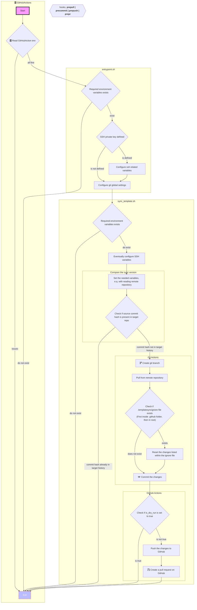

# Architecture

## abstract

within this section you will find some information about the code flow

## Code

The architecture and logic within the code:

```mermaid
flowchart TD
Exit[Exit]
Start[Start]
GitHubActionEnv{"fa:fa-github Read GitHubAction env"}

style Start fill:#f9f,stroke:#333,stroke-width:4px
style Exit fill:#bbf,stroke:#f66,stroke-width:2px,color:#fff,stroke-dasharray: 5 5

EnvCheckEntry{Required environment variables exists}
SshCheckEntry{SSH private key defined}
SshConfigureEntry[Configure ssh related variables]
GitConfigureEntry[Configure git global settings]

EnvCheckSync{Required environment variables exists}
SshConfigureSync[Eventually configure SSH variables]
SetVariablesSync[Set the needed variables, e.q. with reading remote repository]
CheckCommitLocalExistent{"Check if source commit hash is present in target repo"}
GitCheckoutSync["fa:fa-code-branch Create git branch <branch_prefix_git_hash>"]
GitPullSync["Pull from remote repository"]
CheckIgnoreFileExistsSync{"Check if .templatesyncignore file exists\n(First inside .github folder, then in root)"}
ResetChangesSync["Reset the changes listed within the ignore file"]
GitCommitSync["fa:fa-code-commit Commit the changes"]

CheckIsDryRun{"Check if is_dry_run is set to true"}
GitPushSync["Push the changes to GitHub"]
GitPullRequestSync["fa:fa-code-pull-request Create a pull request on GitHub"]
Hook{{"hooks, <b>prepull | precommit | prepush | prepr</b>"}}

subgraph githubactions["fa:fa-github GitHubActions"]

Start --> GitHubActionEnv
GitHubActionEnv -->|issues| Exit


end

subgraph entry["entrypoint.sh"]

GitHubActionEnv -->|all fine| EnvCheckEntry
EnvCheckEntry -->|do not exist| Exit
EnvCheckEntry -->|exist| SshCheckEntry

SshCheckEntry -->|is defined| SshConfigureEntry
SshCheckEntry -->|is not defined| GitConfigureEntry
SshConfigureEntry --> GitConfigureEntry

end


subgraph sync["sync_template.sh"]
GitConfigureEntry --> EnvCheckSync

EnvCheckSync -->|do not exist| Exit
EnvCheckSync -->|do exist| SshConfigureSync
SshConfigureSync --> SetVariablesSync

subgraph compareVersion["Compare the sync version"]
SetVariablesSync --> CheckCommitLocalExistent
CheckCommitLocalExistent -->|commit hash already in target history| Exit
end

subgraph git["Git Actions"]
CheckCommitLocalExistent -->|commit hash not in target history| GitCheckoutSync
GitCheckoutSync --> GitPullSync
GitPullSync --> CheckIgnoreFileExistsSync
CheckIgnoreFileExistsSync -->|does not exist| GitCommitSync
CheckIgnoreFileExistsSync -->|exists| ResetChangesSync
ResetChangesSync --> GitCommitSync
end

subgraph github["GitHub Actions"]
GitCommitSync --> CheckIsDryRun
CheckIsDryRun -->|is true| Exit
CheckIsDryRun -->|is not true| GitPushSync
GitPushSync --> GitPullRequestSync
GitPullRequestSync --> Exit

end

end

```
