# Architecture

## abstract

within this section you will find some information about the code flow

## Code

The architecture and logic within the code:

Both shell entry points source `src/sync_common.sh`. This shared module provides
the `err`, `warn`, `info`, and `debug` logging functions, as well as
`start_group` and `end_group` for GitHub Actions log groups. Keeping these
workflow commands in one place ensures consistent output across setup and sync
operations.

```mermaid
flowchart TD
Start([Start])
Exit([Exit])
Failure([Error and exit])
Inputs[Read GitHub Action inputs and environment]
Common[sync_common.sh<br/>logging and group helpers]

style Start fill:#f9f,stroke:#333,stroke-width:4px
style Exit fill:#bbf,stroke:#f66,stroke-width:2px,color:#fff,stroke-dasharray: 5 5
style Failure fill:#fbb,stroke:#933,stroke-width:2px

subgraph entry["entrypoint.sh"]
  EntryChecks{Required inputs and tools present?}
  GitInit["git_init<br/>configure Git, LFS, and known_hosts"]
  UseSSH{SSH private key provided?}
  SSHSetup["ssh_setup<br/>configure source repository prefix"]
  SourceLogin["gh_login_src_github<br/>authenticate to source"]
  SetSourceRepo["Set SOURCE_REPO"]
  UseGPG{GPG private key provided?}
  GPGSetup["gpg_setup<br/>import key and enable signing"]
  SourceReady[Source setup complete]

  Inputs --> EntryChecks
  EntryChecks -->|no| Failure
  EntryChecks -->|yes| GitInit
  GitInit --> UseSSH
  UseSSH -->|yes| SSHSetup
  UseSSH -->|no| SourceLogin
  SSHSetup --> SetSourceRepo
  SourceLogin --> SetSourceRepo
  SetSourceRepo --> UseGPG
  UseGPG -->|yes| GPGSetup
  UseGPG -->|no| SourceReady
  GPGSetup --> SourceReady
end

subgraph sync["sync_template.sh"]
  SyncChecks{Required variables and tools present?}
  SetVariables["Resolve branches and hashes<br/>configure sync variables"]
  Steps{STEPS provided?}
  ValidateSteps{All steps supported?}
  DefaultSteps["Run all steps:<br/>prechecks, pull, commit, push, pr"]
  SelectedSteps["Dispatch selected supported steps<br/>in the requested order"]
  Unsupported[Report unsupported steps]
  Outputs["set_github_action_outputs<br/>write PR branch, template hash, and PR number"]

  SourceReady --> SyncChecks
  SyncChecks -->|no| Failure
  SyncChecks -->|yes| SetVariables
  SetVariables --> Steps
  Steps -->|no| DefaultSteps
  Steps -->|yes| ValidateSteps
  ValidateSteps -->|no| Unsupported
  ValidateSteps -->|yes| SelectedSteps
  Unsupported --> Failure
  DefaultSteps --> Outputs
  SelectedSteps --> StepDispatch
  Outputs --> Exit
end

subgraph operations["Sync steps"]
  Prechecks["prechecks<br/>skip if force push; otherwise check branch and history"]
  Existing{Branch exists or commit is already present?}
  PullHook["prepull hook"]
  Pull["Create sync branch and pull source changes"]
  TargetLogin["gh_login_target_github<br/>authenticate to target after pull"]
  RestoreIgnore["Restore .templatesyncignore"]
  ForceDelete{Force deletion enabled?}
  DeleteFiles["Delete files removed upstream"]
  CommitHook["precommit hook"]
  Commit["Stage changes, apply ignore rules, and commit"]
  Changes{Changes staged?}
  DryRunPush{Dry run enabled?}
  PushHook["prepush hook"]
  Push["Push branch to target"]
  DryRunPR{Dry run enabled?}
  Labels["Create missing PR labels"]
  Cleanup{PR cleanup enabled and labels set?}
  CleanupPRs["precleanup hook<br/>close older PRs"]
  PRHook["prepr hook"]
  CreatePR{Force push PR enabled?}
  Create["Create PR"]
  Edit["Create or edit PR"]

  DefaultSteps --> Prechecks
  StepDispatch["Invoke the selected step function"]
  StepDispatch --> Prechecks
  StepDispatch --> PullHook
  StepDispatch --> CommitHook
  StepDispatch --> PushHook
  StepDispatch --> Labels
  Prechecks --> Existing
  Existing -->|yes| Outputs
  Existing -->|no| PullHook
  PullHook --> Pull
  Pull --> TargetLogin
  TargetLogin --> RestoreIgnore
  RestoreIgnore --> ForceDelete
  ForceDelete -->|yes| DeleteFiles
  ForceDelete -->|no| CommitHook
  DeleteFiles --> CommitHook
  CommitHook --> Commit
  Commit --> Changes
  Changes -->|no| Outputs
  Changes -->|yes| DryRunPush
  DryRunPush -->|yes| DryRunPR
  DryRunPush -->|no| PushHook
  PushHook --> Push
  Push --> DryRunPR
  DryRunPR -->|yes| Outputs
  DryRunPR -->|no| Labels
  Labels --> Cleanup
  Cleanup -->|yes| CleanupPRs
  Cleanup -->|no| PRHook
  CleanupPRs --> PRHook
  PRHook --> CreatePR
  CreatePR -->|yes| Edit
  CreatePR -->|no| Create
  Edit --> Outputs
  Create --> Outputs
end

Start --> Common
Common --> Inputs
```

