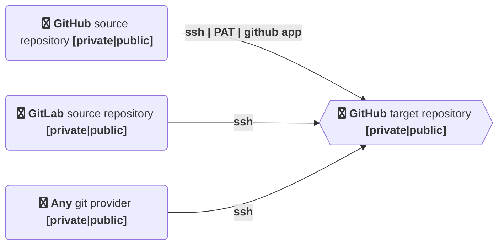

# Docs

## abstract

Within this section you can find some more detailed doumentation.

```mermaid
flowchart LR
    github_source("fa:fa-github <b>GitHub</b> source repository <b>[private|public]</b>")
    gitlab_source("fa:fa-gitlab <b>GitLab</b> source repository <b>[private|public]</b>")
    any_source("fa:fa-git <b>Any</b> git provider <b>[private|public]</b>")
    github_target{{"fa:fa-github <b>GitHub</b> target repository <b>[private|public]</b>"}}
    github_source --> |"<b>ssh | PAT | github app</b>"| github_target
    gitlab_source --> |"<b>ssh</b>"| github_target
    any_source --> |"<b>ssh</b>"| github_target
```

- [architecture](./ARCHITECTURE.md)
